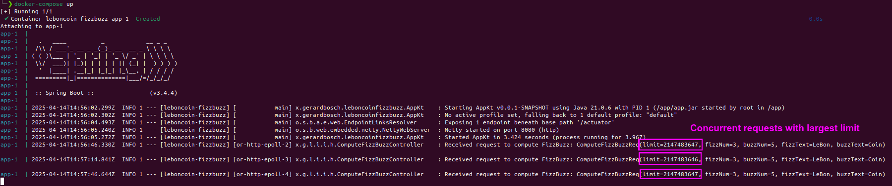
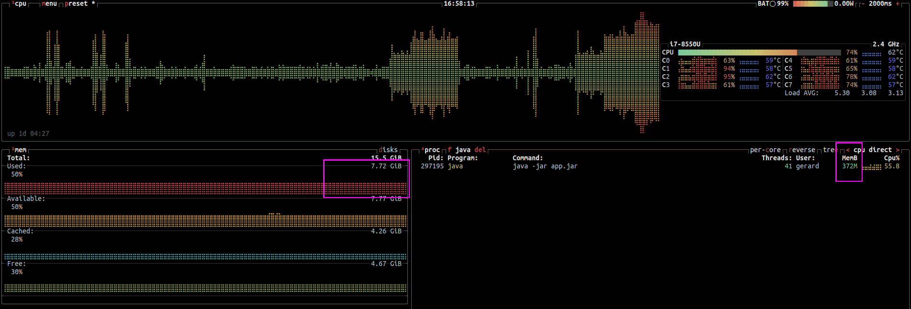

# LeBonCoin FizzBuzz

[](https://github.com/gerardbosch/leboncoin-fizzbuzz/actions/workflows/test.yml)

> [!IMPORTANT]
> I published this solution with the permission and as required by LeBonCoin.

## Description

The project implements 2 endpoints:

1. `POST /fizzbuzz` - Generates a FizzBuzz sequence from the parameters in the body (see cURL example below).
2. `GET /fizzbuzz/stats/most-frequent` - Returns the most frequent request.

- When there’s a draw in the frequency counter of several requests, the newest wins. This is just an arbitrary decision. Other mechanisms could be considered, like returning a list of all parameters with the max. frequency.

The application contains 3 use cases. They are located in the `application` package:
- `ComputeFizzBuzzUseCase` - Computes the FizzBuzz sequence.
- `UpdateStatsUseCase` - Updates the statistics.
- `GetStatsUseCase` - Gets the statistics.

The algorithmic parts can be found at:
- [FizzBuzzGenerator.kt](./src/main/kotlin/xyz/gerardbosch/leboncoinfizzbuzz/domain/fizzbuzzgeneration/FizzBuzzGenerator.kt)
- [InMemoryStatsRepository.kt](./src/main/kotlin/xyz/gerardbosch/leboncoinfizzbuzz/infrastructure/outgoing/db/InMemoryStatsRepository.kt)

## How to run

Prerequisites:
- **JDK 21**  if run with Gradle. *You can install it with [Sdkman](https://sdkman.io/), e.g.* `sdk install java 21.0.6-tem`
- **Docker** (with compose) if run with Docker compose


**Run the application tests**

```
./gradlew check
```

**Start the application**

You can start it with Gradle or with Docker:

1. Start with Gradle:

   ```
   ./gradlew bootRun
   ```

2. Start with Docker compose:  
   This will build a Docker image from the code (including running tests) and start the application (see `compose.yaml`).

   ```
   docker-compose up
   ```

	💡 Use `--build` flag in case the source code is changed in order to force building a new image.

**Execute a request with cURL**

The API is implemented with WebFlux, which means that the response will be directly streamed out 
on-the-fly (no need to buffer the whole response in-memory). This allows to deal with huge 
responses efficiently with non-blocking I/O.

```console
curl -X POST 'localhost:8080/fizzbuzz' -H 'Content-Type: application/json' -d '{"limit":15, "fizzNum":3, "buzzNum":5, "fizzText":"LeBon", "buzzText":"Coin"}'
```

Let’s try now to generate it using `limit` with the maximum value of `Int`: `2147483647`

```console
curl -X POST 'localhost:8080/fizzbuzz' -H 'Content-Type: application/json' -d '{"limit":2147483647, "fizzNum":3, "buzzNum":5, "fizzText":"LeBon", "buzzText":"Coin"}'
```

💡**Hint:** Press `Ctrl-C` to stop.

**Monitor memory**

We can check that the memory remains constant and that streaming very large amounts of data does not affect the system performance.





## Implementation details

- The use of WebFlux (non-blocking IO) allows to stream the response instead of buffering in memory, enables for high degree of concurrency, to return huge amounts of data (like 2 billion FizzBuzz elements) and it could also potentially benefit from the backpressure feature if the client of the API supported that.

- Another interesting thing is the `intersperse()` operator and how using declarative or functional programming idioms we can implement it without mutability, in a concise and declarative way (see [FlowExtensions.kt](./src/main/kotlin/xyz/gerardbosch/leboncoinfizzbuzz/util/FlowExtensions.kt) ).  

  Typically functional collections (talking about Functional Programming) offer a combinator called `intersperse()` that allows to insert an element within a sequence or a stream. As neither `kotlin.Flow` nor reactor `Flux` ofer that, let’s implement our own extension for thtat. This will be a very flexible thing as will allow for high code reuse.

- The stats endpoint is implemented using a HashMap and tracking the most frequent request. That provides constant `O(1)` retrieval time.

  It’s also worth noticing that on a real cloud-native application with high traffic, we would need to use a distributed cache or store. Under that circumstances, we would need to evaluate solutions like Redis, and assess if they fit with our requirements.


## Tech stack

- Kotlin
- Spring Boot
- Spring WebFlux
- Kotest

## Features

- Use of Clean Architecture™, Value Objects and other concepts from DDD:  
  This allows to separate the business logic from the infrastructure and presentation layers. This 
  makes the code more maintainable, testable and flexible.
- Reactive generation API with WebFlux.
- Concurrency control for the statistics.
- Configuration properties listed below (see `application.properties`):
  ```properties
  app.fizzbuzz.start=1
  app.fizzbuzz.delimiter=,
  ```

## Assumptions

**Single node deployment:**  
The exercise doesn’t mention concurrency control or distributed systems. For the sake of the exercise we assume that it’s going to be deployed as a single instance. Although the solution has taken into account concurrency, and the stats are updated atomically.

## Shortcuts

The following shortcuts has been taken to reduce the scope of the exercise and to not create more code.

- Mapping HTTP request body (infrastructure model) into a domain object (domain model) instead of creating UseCase Command objects and more mappers to go from `infra -> application -> domain`.

## What's missing

Due to the reduced scope of the project the following has been left out:

- API annotations with OpenAPI docs.
- Though there's a basic error handling, a more exhaustive error handling could be implemented.
- More tests could be added.
